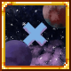

# Terraria_CrossWorlds 

Cross Worlds is a Terraria Mod (TModLoader) for data synchronization between worlds.
The mod generates a list of Worlds that are synchronized, worlds can be added to the list from the in-game mod menu.
Added worlds share Time (`Main.time` and `Main.dayTime`) and Moon Phase (`Main.moonPhase`).
